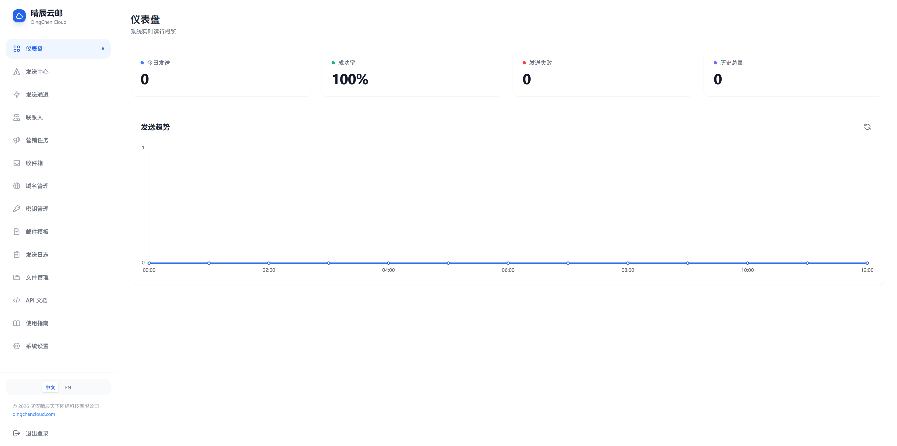
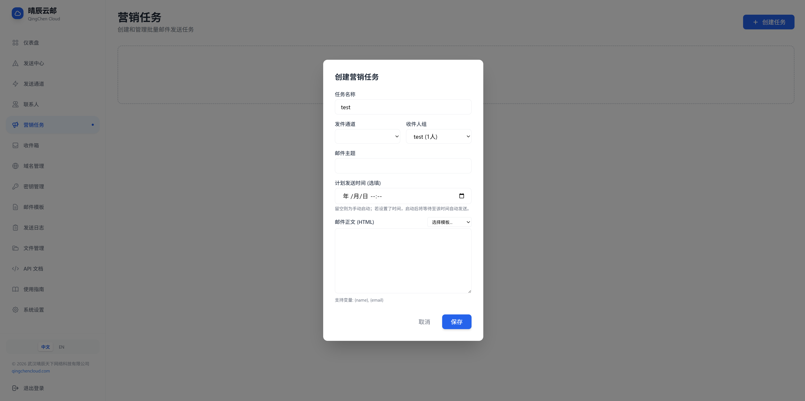
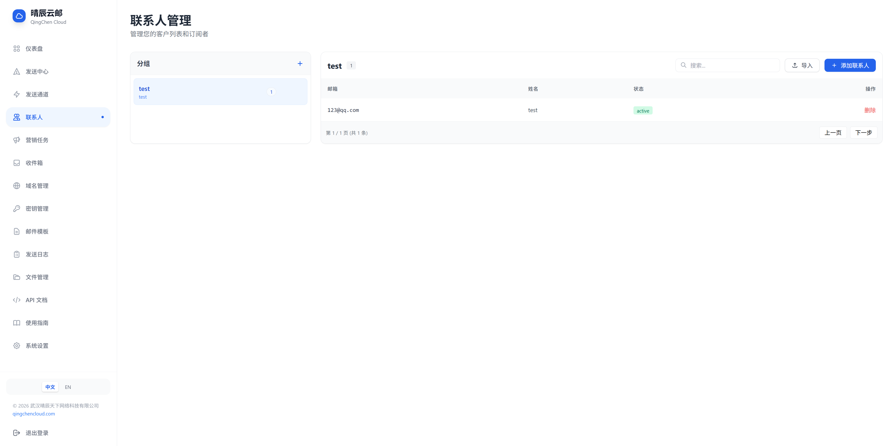
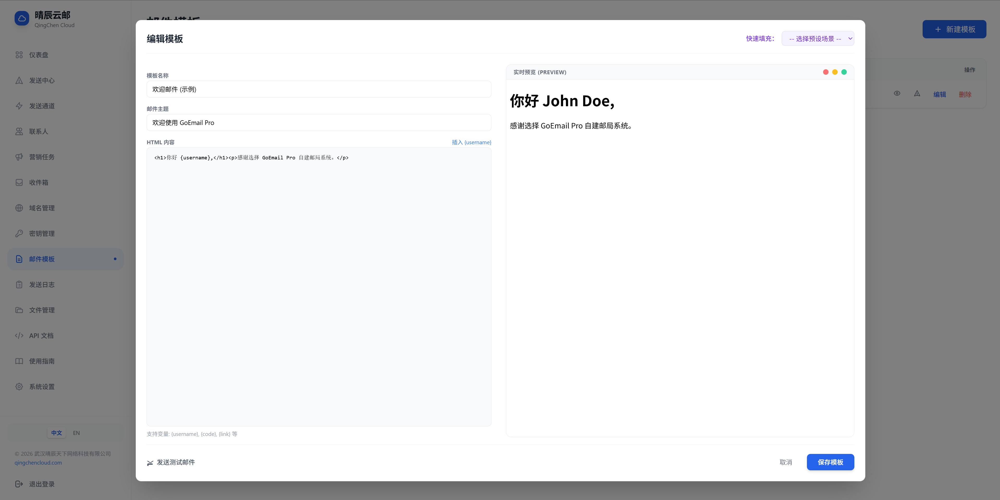
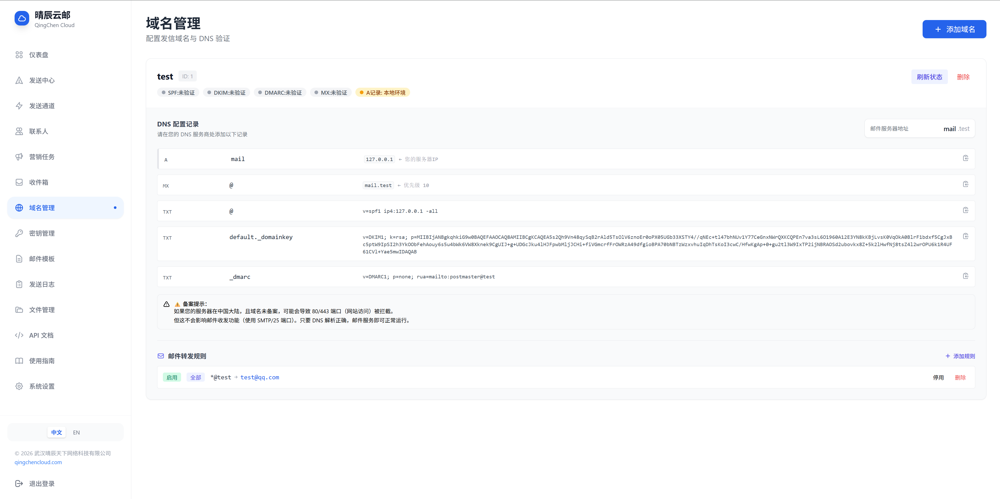
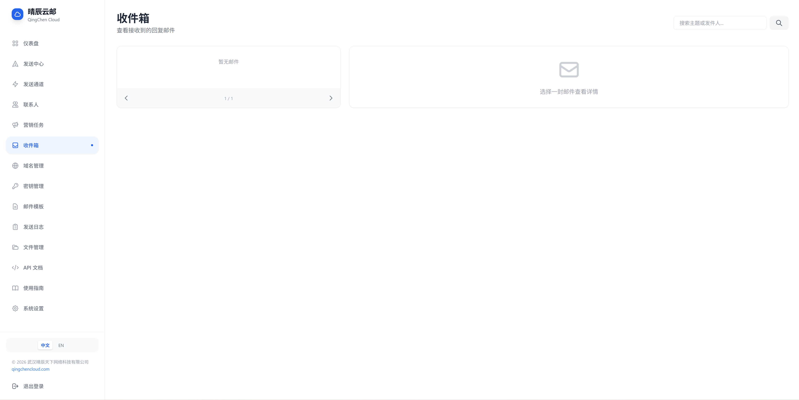
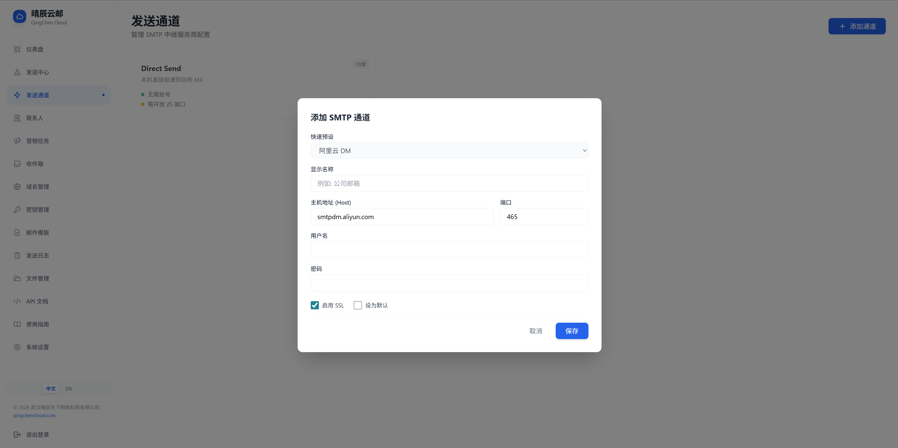
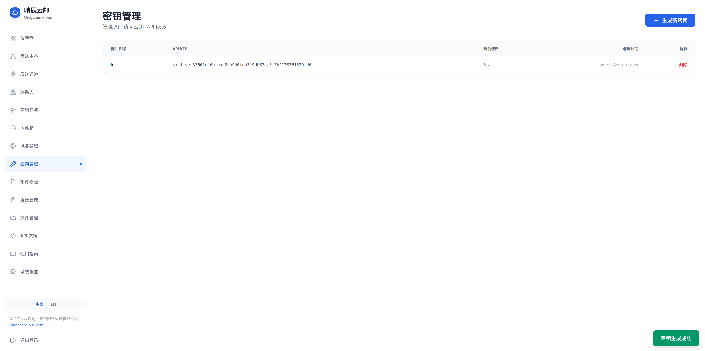
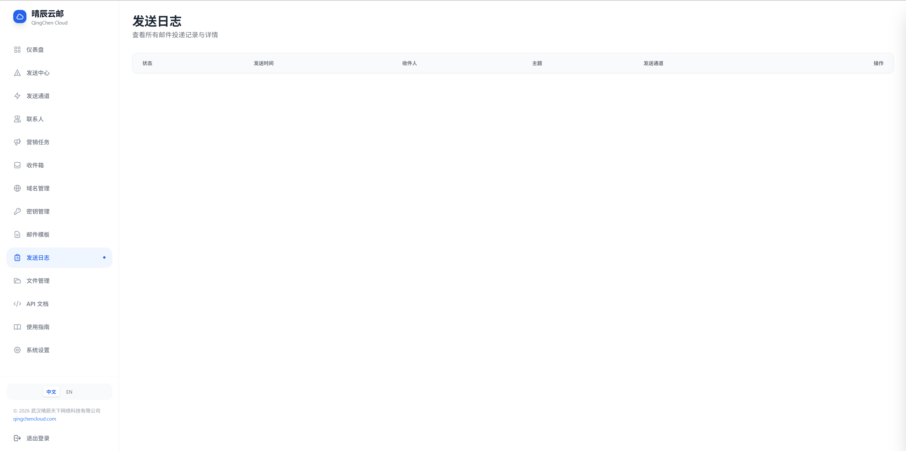
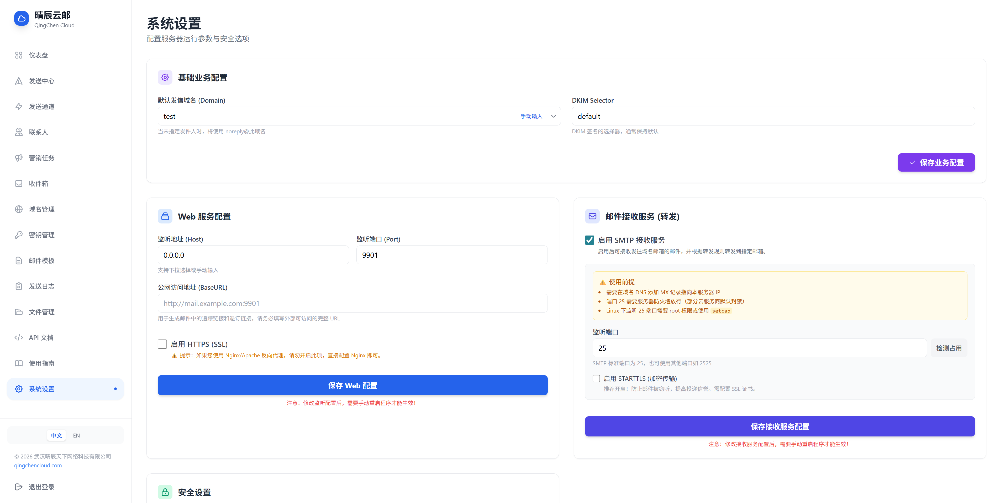

<p align="center">
  
</p>

<h1 align="center">QingChen Mail</h1>

<p align="center">
  <strong>🚀 Enterprise-Grade Self-Hosted Email System · All-in-One Solution for Sending/Receiving/Marketing</strong>
</p>

<p align="center">
  <a href="https://github.com/1186258278/QingChenMail/releases"></a>
  <a href="LICENSE"></a>
  <a href="https://golang.org"></a>
  <a href="https://github.com/1186258278/QingChenMail/actions"></a>
  <a href="https://qingchencloud.com"></a>
</p>

<p align="center">
  <a href="README.md">中文</a> · <a href="docs/README_en.md">English</a> · <a href="docs/INSTALL_zh-CN.md">Deployment Guide</a> · <a href="https://github.com/1186258278/QingChenMail/releases">Download</a>
</p>

---

## 💡 Why Choose QingChen Mail?

| Pain Point | Traditional Solutions | QingChen Mail |
|:---:|:---:|:---:|
| **Cost** | Third-party EDM pay-as-you-go, more emails = higher cost | **One-time deployment, permanently free** |
| **Privacy** | Email content passes through 3rd-party servers, risk of leaks | **100% data ownership and control** |
| **Flexibility** | Limited APIs, impossible to customize | **Open source, fully open RESTful API** |
| **Deliverability** | Shared IPs easily flagged as spam | **Dedicated IP + Auto-config for DKIM/SPF/DMARC** |

---

## ✨ Core Capabilities

<table>
<tr>
<td width="50%">

### 📤 Intelligent Sending Engine

- **Dual-Mode Delivery**: Intelligent switching between Direct Send and SMTP Relay.
- **High Deliverability**: Automatic DKIM signing + SPF/DMARC record generation.
- **Subdomain Isolation**: Separation of marketing and transactional emails to protect primary domain reputation.
- **Asynchronous Queue**: Built-in high-performance queue supporting failure retries and concurrency control.
- **Marketing Tasks**: Support for pause/resume, real-time progress tracking, and open-rate statistics.

</td>
<td width="50%">

### 📥 Email Gateway

- **SMTP Receiving**: Built-in SMTP Server to receive emails for domain mailboxes.
- **STARTTLS Encryption**: Supports TLS encrypted transmission to prevent eavesdropping.
- **Intelligent Forwarding**: Wildcard/prefix matching with automatic forwarding to Gmail/QQ.
- **MIME Parsing**: Automatic Base64/QP decoding, supporting Chinese characters without corruption.
- **Attachment Handling**: Automatic extraction and storage with online preview support.

</td>
</tr>
<tr>
<td>

### 🛡️ Security Protection

- **Two-Factor Authentication (2FA)**: TOTP dynamic passwords, compatible with Google/Microsoft Authenticator.
- **Rate Limiting**: IP-level connection limits to prevent DDoS/Brute-force attacks.
- **IP Blacklist**: One-click banning of malicious IPs.
- **JWT Authentication**: Dual verification using Secure Tokens + API Keys.
- **Password Encryption**: Secure storage using bcrypt hashing.
- **HTTPS Support**: Full-site SSL encryption.
- **Certificate Management**: Automatic Let's Encrypt application/renewal, supporting manual upload.
- **Automatic Backup**: Automatic backup before updates with one-click rollback support.

</td>
<td>

### 🔧 Developer Friendly

- **RESTful API**: Standard interfaces supporting Bearer Tokens.
- **Permanent Keys**: `sk_live_...` format for easy integration.
- **Template Engine**: `{{.name}}` variable replacement for personalized content.
- **Webhook Callbacks**: Real-time push of delivery status.
- **Interactive Documentation**: Built-in API docs + AI prompts.
- **Online Updates**: One-click check/download/install of new versions.
- **Hot Restart**: Automatic restart after updates without manual intervention.

</td>
</tr>
</table>

---

## 🖼️ System Preview

<table>
<tr>
<td align="center"><b>Dashboard</b><br></td>
<td align="center"><b>Marketing Tasks</b><br></td>
</tr>
<tr>
<td align="center"><b>Contact Management</b><br></td>
<td align="center"><b>Email Templates</b><br></td>
</tr>
<tr>
<td align="center"><b>Domain Config</b><br></td>
<td align="center"><b>Inbox</b><br></td>
</tr>
</table>

<details>
<summary>📸 View more screenshots</summary>

| Sending Channels | Key Management |
|:---:|:---:|
|  |  |

| Sending Logs | System Settings |
|:---:|:---:|
|  |  |

</details>

---

## 🚀 Quick Start

### 1️⃣ Download and Run

```bash
# Download the binary file for your platform from Releases
# https://github.com/1186258278/QingChenMail/releases

# Linux/macOS
chmod +x goemail && ./goemail

# Windows
goemail.exe
```

### 2️⃣ Access Admin Panel

Open `http://localhost:9901` in your browser.

| Item | Value |
|:---:|:---:|
| Default Account | `admin` |
| Default Password | `123456` |

> ⚠️ **Please change your password immediately after first login and enable Two-Factor Authentication (2FA)!**

### Command Line Arguments

```bash
# Reset administrator password to 123456
./goemail -reset

# Reset administrator Two-Factor Authentication (use when 2FA is forgotten)
./goemail -reset-totp
```

### 3️⃣ Send Your First Email

```bash
curl -X POST http://localhost:9901/api/v1/send \
  -H "Authorization: Bearer sk_your_api_key" \
  -H "Content-Type: application/json" \
  -d '{
    "to": "test@example.com",
    "subject": "Hello from QingChen Mail",
    "body": "<h1>Welcome to QingChen Mail!</h1>"
  }'
```

---

## 📦 Feature Checklist

| Module | Feature | Status |
|:---|:---|:---:|
| **Sending Center** | Single/Batch sending, attachment support, HTML templates | ✅ |
| **Marketing Tasks** | Scheduled sending, pause/resume, progress tracking, statistics | ✅ |
| **Contacts** | Group management, import/export, unsubscribe management | ✅ |
| **Inbox** | SMTP receiving, MIME parsing, attachment extraction, batch operations | ✅ |
| **Forwarding Rules** | Exact/Prefix/Wildcard matching, multi-target forwarding | ✅ |
| **Domain Management** | Multi-domain support, auto DKIM generation, DNS verification | ✅ |
| **Sending Channels** | SMTP relay config, direct send, load balancing | ✅ |
| **Security** | **2FA Two-Factor Auth**, STARTTLS, Rate Limiting, IP Blacklist | ✅ |
| **Cert Management** | Let's Encrypt auto-application, manual upload, auto-renewal | ✅ |
| **Data Cleanup** | Scheduled auto-cleanup, retention policy config, manual cleanup | ✅ |
| **System Settings** | HTTPS, port config, backup and recovery | ✅ |
| **API** | RESTful interface, permanent keys, interactive docs | ✅ |

---

## ⚙️ Configuration Guide

<details>
<summary>📝 config.json Example</summary>

```json
{
  "domain": "mail.example.com",
  "host": "0.0.0.0",
  "port": "9901",
  "base_url": "https://mail.example.com",
  "enable_ssl": false,
  "enable_receiver": true,
  "receiver_port": "25",
  "receiver_tls": true,
  "receiver_rate_limit": 30,
  "receiver_max_msg_size": 10240,
  "cleanup_enabled": true,
  "cleanup_email_log_days": 30,
  "cleanup_inbox_days": 30
}
```

</details>

<details>
<summary>🔐 DNS Record Configuration</summary>

```
# MX Record (Receiving)
@    MX    10    mail.example.com.

# SPF Record (Sending Verification)
@    TXT   "v=spf1 ip4:YOUR_SERVER_IP ~all"

# DKIM Record (Signature Verification)
default._domainkey    TXT    "v=DKIM1; k=rsa; p=YOUR_PUBLIC_KEY"

# DMARC Record (Policy)
_dmarc    TXT    "v=DMARC1; p=quarantine; rua=mailto:admin@example.com"
```

</details>

---

## 🏗️ Technical Architecture

```
┌─────────────────────────────────────────────────────────────┐
│                      QingChen Mail Architecture             │
├─────────────────────────────────────────────────────────────┤
│  ┌─────────┐    ┌─────────┐    ┌─────────┐    ┌─────────┐  │
│  │  Web UI │    │   API   │    │  SMTP   │    │  Queue  │  │
│  │ (HTML5) │    │  (Gin)  │    │ Server  │    │ Worker  │  │
│  └────┬────┘    └────┬────┘    └────┬────┘    └────┬────┘  │
│       │              │              │              │        │
│       └──────────────┴──────────────┴──────────────┘        │
│                          │                                   │
│                    ┌─────┴─────┐                            │
│                    │   GORM    │                            │
│                    │  SQLite   │                            │
│                    └───────────┘                            │
└─────────────────────────────────────────────────────────────┘
```

| Layer | Tech Stack |
|:---:|:---|
| **Backend** | Go 1.21+ · Gin · GORM · SQLite |
| **Frontend** | HTML5 · TailwindCSS · Chart.js |
| **Email** | go-mail · go-msgauth (DKIM) · STARTTLS |
| **Security** | bcrypt · JWT · TOTP (2FA) · Rate Limiter |
| **Certificates** | ACME · Let's Encrypt · lego |

---

## 🤝 Contributing

Contributions, issues, and pull requests are welcome!

1. Fork the repository
2. Create a feature branch: `git checkout -b feature/amazing-feature`
3. Commit your changes: `git commit -m 'feat: add amazing feature'`
4
4. Push the branch: `git push origin feature/amazing-feature`
5. Submit a Pull Request

See the [Contribution Guide](CONTRIBUTING.md) for details.

---

## 📄 License

This project is licensed under the [MIT License](LICENSE) and is free for commercial use.

---

<p align="center">
  <b>© 2026 Wuhan QingChen TianXia Network Technology Co., Ltd.</b><br>
  <a href="https://qingchencloud.com">Official Website</a> · 
  <a href="https://github.com/1186258278/QingChenMail/issues">Feedback</a> · 
  <a href="docs/INSTALL_zh-CN.md">Docs</a>
</p>

<p align="center">
  If this project helped you, please give it a ⭐ Star for support!
</p>
